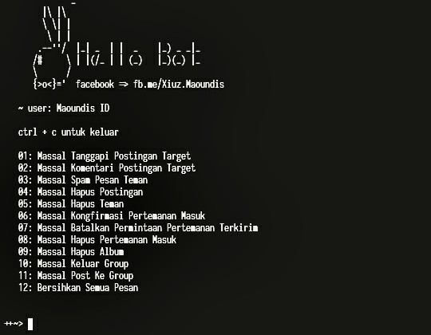

# BotFucek
simple bot



### support termux
```bash
pkg install ruby clang make binutils
gem install thread
bundle config set force_ruby_platform true
bundle install
ruby main.rb
ex :
c_user=100xxx;datr=xxxxxx;fr=xxxxx;sb=xxxxx;xs=xxxxx

```

+ jika ade bug silahkeun lapor ke facebook saya <a href="https://fb.me/Xiuz.Maoundis">Muhammad Ikbal</a>
